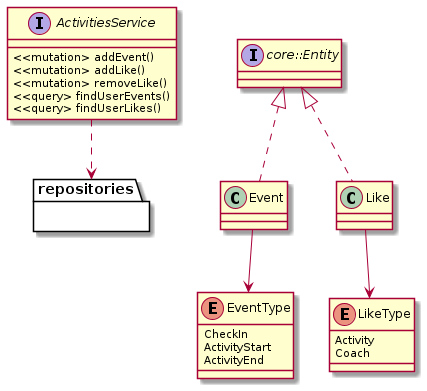

# Activities Service API

This is a Typescript/Node/Express/MongoDB REST API for Activities that uses JWT for authentication.

# Getting Started
This service manages activities event tracking and likes.

## Domain Model


## Service REST endpoints
- `POST /events`: Add event for logged in user
- `GET /events`: Retrieve events for logged in user
- `POST /likes`: Add like for logged in user
- `DELETE /likes`: Mark existing like as removed
- `GET /likes`: Retrieve user likes
- `GET /events/daily`: Retrieve daily events summary
- `GET /events/monthly`: Retrieve monthly events summary

# Usage

## Install dependencies and/or build
```bash
yarn install
yarn build
```

## Run in dev or build
```bash
yarn dev
yarn start
```

## Environment variables

```bash
DB_URL=<mongo-connection-string>
DB_OPTIONS=<mongo-connection-options>
SECRET=<bcrypt-secret>
SERVER_HOST=(defaults to '0.0.0.0')
PORT=(defaults to 6000)
API_BASE_URI=(defaults to '/')
```

# Running unit tests
Jest based test with coverage details.
```bash
yarn test
```

## Credits

- Michael Elliott